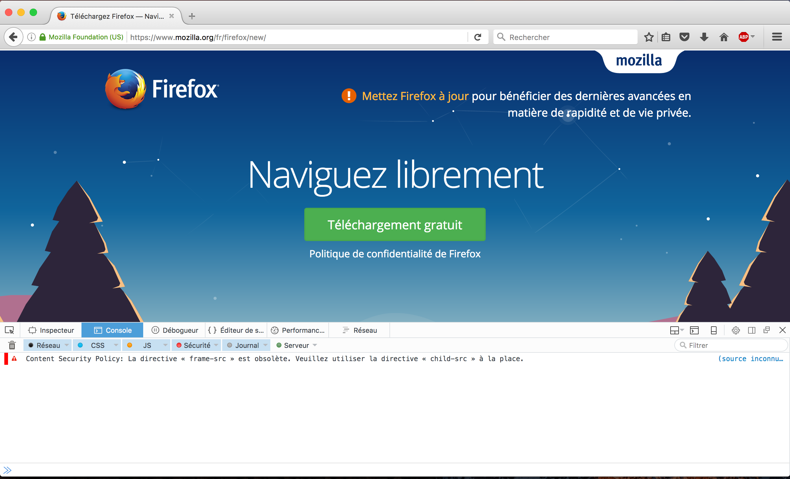
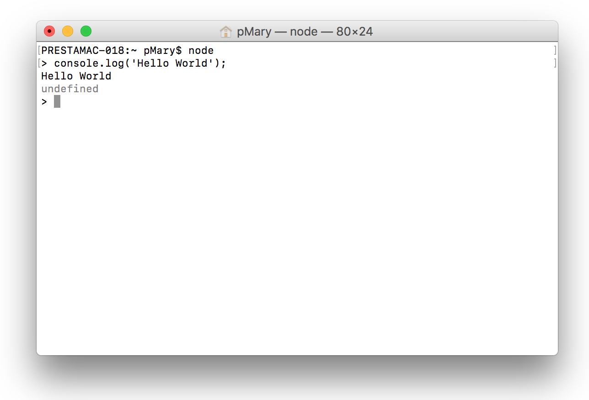

# 1.8 Setup your environment

This days, JavaScript is used both server and client side but it was originally made for a web browser usage only. The main difference is that this _web flavor_ does not include any I/O, such as networking, storage, or graphics facilities. The _server flavor_ however, is based on an event-driven architecture capable of asynchronous I/O. 

## Work client side
Play with JavaScript client side is pretty easy. Just open your web browser, Mozilla Firefox for exemple, and open the development tools. Use the `Ctrl + Shift + I` shortcut on Windows or `Cmd + Opt + I` on a Mac. You can do the same with Google Chrome.

Next, navigate to the `Console` tab. At the bottom, you have an input that let you type JavaScript code. Your code will be directly interpreted by the browser and display the output. You can learn more about Firefox the console on MDN: https://developer.mozilla.org/en-US/docs/Tools/Web_Console.

## Work server side
Work client side will require extra steps. First, you need to install Node.js. You can find an installer for your OS on the official website https://nodejs.org/en/download. Next we will open the terminal (or the command line tool) and see how to execute JavaScript code. The procedure differ following your OS.

To open the Windows command line interpreter:

1. Click Start
2. In the Search or Run line type cmd and press enter.

To open the Mac terminal:

1. Use the `Cmd + Space` shortcut, type terminal and press enter.

Now you can type `node` and press enter. It will launch the Node.js console ans everthing you will type will be interpreted by Node.js. Try to type `console.log('Hello World')` for exemple:

The output will be the same as in the web browser console.
You can also interprete files using this syntax:  
`$ node /my_file.js`

You are now ready to work with Node.js!